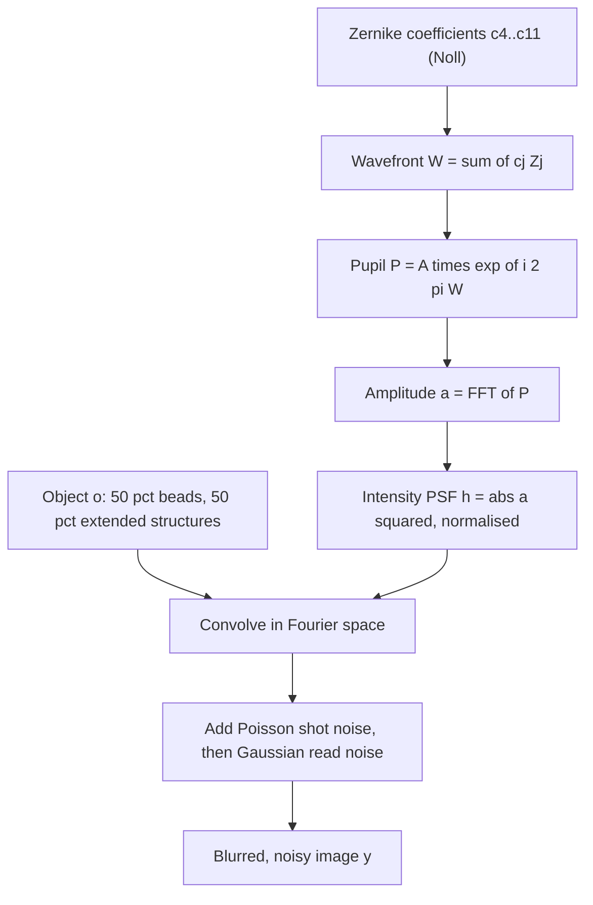
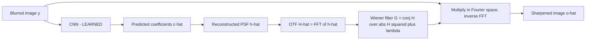
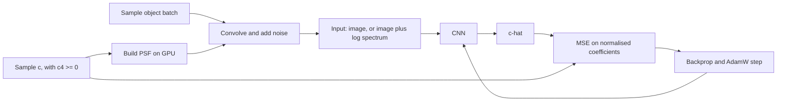

# Plan — ML Microscopy Deconvolution Demo

Phase 2 output. Turns `RESEARCH.md` into a concrete notebook structure, code
layout and execution budget.

---

## 0. Decisions made in this phase

| # | Decision | Rationale |
|---|---|---|
| **P1** | **Single self-contained notebook, no `src/` module** | The audience reads physics, not software. Equations should be visible where they are used, not one import away. `ponytail` agrees: a module for ~20 short functions used by one consumer is premature structure. |
| **P2** | **Do not commit model checkpoints** | The committed executed outputs carry the story. Three checkpoints would add ~35 MB of binary to git for no reader benefit. |
| **P3** | **`pooch` is a pinned dependency; images come from skimage's own cache** | Verified: `human_mitosis`/`cells3d`/`kidney` are *not* bundled and fetch from gitlab.com on first call. No download script and no committed images needed — skimage already solves this. One-time network requirement, documented in the notebook. |
| **P4** | **Device-agnostic with a CPU warning** | Target is the 5070 Ti, but the notebook should not crash for a reader on CPU — it should say the runs will be slow and offer a reduced step count. |

---

## 1. The physics, as a graph

How a synthetic micrograph is produced. Everything here is closed-form — no
learning anywhere in this diagram.



The label for supervised training is **`c` itself** — the vector that entered at
the top. This is why the problem is well-posed: we know the answer by construction.

## 2. The inference pipeline

Only the first box is learned. Everything downstream is algebra.



This split is the central teaching point: the network estimates a **physical
quantity**, and a **known inverse** does the restoration. Nothing is a black box
except the 8 numbers.

## 3. The training loop



Data is generated fresh on the GPU every step, so there is no dataset, no
DataLoader and no epoch — only steps. This is what keeps the i9-9900K out of the
critical path.

---

## 4. Notebook layout

Ordered by the **physics narrative**, not the usual ML one. A reader should be
able to stop after any part and have learned something complete.

### Part 0 — Setup
Imports, device selection (with CPU warning per P4), seeds, and the optical
constants table from `RESEARCH.md` §3 as executable code.

### Part 1 — How a microscope blurs
| § | Content | Figure |
|---|---|---|
| 1.1 | The pupil and the wavefront; the 8 Noll polynomials written out | Zernike mode gallery (8 panels) |
| 1.2 | **Orthonormality unit test** — assert `⟨Zi,Zj⟩ = δij` | Pass/fail output |
| 1.3 | Pupil → amplitude → intensity PSF | — |
| 1.4 | The Airy disc: all `c = 0` | PSF + radial profile, with the 226.6 nm first zero marked |
| 1.5 | Aberrated PSFs, one mode at a time | PSF gallery per mode |
| 1.6 | The OTF and its cutoff at `2·NA/λ` | OTF with cutoff ring marked |
| 1.7 | Forward model end to end | Object → blurred → noisy triptych |

### Part 2 — Why you cannot simply invert
| § | Content | Figure |
|---|---|---|
| 2.1 | Naive inverse filtering: divide by the OTF | The catastrophe — pure noise |
| 2.2 | Why: cutoff, interior zeros, `N/H` amplification | OTF slice with zeros marked, log scale |
| 2.3 | The Wiener filter, and what `λ_reg` buys | — |
| 2.4 | `λ_reg` sweep over a decade | Bias/variance strip: noisy → good → blurry |
| 2.5 | Richardson–Lucy, the microscopist's tool | RL vs Wiener side by side |
| 2.6 | **The punchline**: every method above needs `h`. We don't have it. | — |

### Part 3 — Learning the PSF
| § | Content | Figure |
|---|---|---|
| 3.1 | The GPU data generator | Sample batch: beads and extended structures |
| 3.2 | The label: 8 coefficients, `Z4 ≥ 0`, normalisation | Coefficient distribution histogram |
| 3.3 | The CNN | Layer summary + parameter count |
| 3.4 | **Overfit-one-batch smoke test** — GATE | Loss → ~0 on 8 samples |
| 3.5 | Run 1: image-only | Loss curve |
| 3.6 | Run 2: image + log spectrum | Loss curve |
| 3.7 | Comparison, and per-coefficient error | Grouped bar chart per Noll mode |

Expected in 3.7: `Z4` (defocus) is the weakest mode even with the sign
restriction, and the spectrum channel should help most on the high-order modes
whose OTF signature is a distinctive ring pattern.

### Part 4 — Closing the loop
| § | Content | Figure |
|---|---|---|
| 4.1 | Predicted `ĉ` → PSF → Wiener → sharpened | True vs predicted PSF side by side |
| 4.2 | **The money plot**: three-way comparison | Blurred / naive-PSF / **predicted** / oracle / ground truth |
| 4.3 | Metrics: PSNR, SSIM, FRC | Table + FRC curves with the resolution crossing marked |

### Part 5 — Does it work on real data?
| § | Content | Figure |
|---|---|---|
| 5.1 | Held-out real images, and the honesty caveat (§6 below) | `human_mitosis` and `kidney` samples |
| 5.2 | Run 1/2 model applied to real data — **the sim-to-real gap** | Same three-way plot, on real images |
| 5.3 | Run 3: retrain the winning variant with 10 % real `cells3d` | Loss curve |
| 5.4 | Did the gap close? | Before/after metric table |

### Part 6 — Limitations and what a real system would add
2D only; spatially-invariant PSF; scalar diffraction; defocus-sign degeneracy;
phase diversity as the standard fix; 3D and spatially-varying PSFs as the real
problem; CARE-style direct restoration as the alternative approach not taken.

---

## 5. Code architecture

All inline (P1). Roughly 20 short functions, grouped by the part that introduces
them.

```
Part 1  zernike_noll(j, rho, theta)      the 8 closed-form polynomials
        zernike_basis(n, radius)          -> (8, N, N), precomputed once
        pupil_from_coeffs(c, basis)       -> complex pupil
        psf_from_pupil(P)                 -> normalised intensity PSF
        otf_from_psf(h)
        convolve_fft(obj, psf)
        add_noise(img, photons, read_sigma)

Part 2  wiener_filter(otf, lam)
        apply_wiener(y, otf, lam)
        naive_inverse(y, otf)             deliberately unregularised

Part 3  sample_coeffs(batch)              uniform, with c4 >= 0
        make_beads(batch, size)
        make_extended(batch, size)        filaments, blobs, discs
        synth_batch(batch, real_frac)     the whole GPU pipeline
        load_real_slices(which)           cells3d / mitosis / kidney
        class PSFNet(nn.Module)
        train(model, steps, ...)          one function, reused for all 3 runs

Part 4  psnr(a, b) / ssim(a, b)           skimage
        frc(img_a, img_b)                 two independent noise draws
        three_way_compare(...)            the money plot
```

`train()` being a single reused function is what keeps three runs from becoming
three copies of a training loop.

### Object generators

| Generator | Spec |
|---|---|
| `make_beads` | 30–150 sub-diffraction emitters per 128² field, sub-pixel placement, log-uniform intensity over ~1 decade, small constant background |
| `make_extended` | Random filaments (random walks, dilated), blobs and discs at varying density — crude mimics of cytoskeleton and nuclei |

### Noise

Randomized per sample: peak photons log-uniform in ~50–2000, Poisson, then
Gaussian read noise `σ ≈ 1–5` ADU.

---

## 6. Data handling (P3)

| Purpose | Source | Access |
|---|---|---|
| Training, synthetic | Generated on GPU | None |
| Training, real (Run 3 only) | `skimage.data.cells3d()` → 60 z × 2 ch = **120 slices**, 256² | pooch, cached |
| **Held out** | `skimage.data.human_mitosis()` 512², `skimage.data.kidney()` 16 z × 3 ch = 48 slices 512² | pooch, cached |
| Fully offline fallback | `skimage.data.cell()` 660×550, bundled | none |

Verified working: all three fetch from gitlab.com into
`~/.cache/scikit-image/<version>/` on first call. Nothing is committed to the repo.

**Preprocessing for real images:** convert to float, per-image normalise to
`[0,1]`, extract 128² (or 256²) crops. `cells3d` channel 0 is membranes,
channel 1 is nuclei — both usable, and they give usefully different texture
statistics.

**The caveat to print in the notebook, not bury:** these images are *already
blurred* by the microscope that acquired them. Treating them as sharp ground
truth means our synthetic PSF is an additional blur on top of an unknown
existing one. Standard practice, but stated explicitly.

---

## 7. Execution budget

| Stage | Estimate |
|---|---|
| Parts 0–2 (physics, classical baselines, λ sweep) | < 1 min |
| Overfit-one-batch smoke test | < 1 min |
| Run 1 — image-only, 128², ~30 k steps | ~12 min |
| Run 2 — image + spectrum | ~12 min |
| Run 3 — winner + 10 % real | ~12 min |
| Evaluation, metrics, figures | ~5 min |
| Final 256² figure run | ~15 min |
| **Total** | **~60 min** |

Against a 4 h budget this leaves roughly 3× headroom — room for a longer run or
a hyperparameter sweep if the first results disappoint.

---

## 8. Hyperparameters (from `RESEARCH.md` §5.3)

| Setting | Value |
|---|---|
| Optimizer | AdamW, `lr = 3e-4`, `weight_decay = 1e-4` |
| Schedule | Cosine annealing, 500-step linear warmup |
| Batch | 64 at 128² |
| Steps | 30 000 |
| Precision | bf16 autocast |
| Loss | MSE on range-normalised coefficients |
| Augmentation | **None** |
| Seed | Fixed, set for torch / numpy / python |

---

## 9. Build order for Phase 3

Strictly bottom-up, so each layer is verified before the next depends on it:

1. Zernike basis + **orthonormality test** ← if this is wrong, everything is wrong
2. Pupil → PSF → OTF; verify the Airy disc against `0.61·λ/NA` analytically
3. Forward model: convolve + noise
4. Classical inverse: naive, Wiener, RL with a **known** PSF ← *sanity gate: if this doesn't visibly sharpen, stop*
5. Object generators
6. CNN + `train()`
7. **Overfit-one-batch** ← *gate*
8. The three runs
9. Evaluation and figures
10. Real-data transfer

Steps 1, 4 and 7 are the three places where a silent bug would otherwise survive
all the way to a confusing final result.

---

## 10. Risks specific to the build

| Risk | Mitigation |
|---|---|
| Zernike convention error | Orthonormality test at step 1, plus visual mode gallery — a wrong mode is obvious to the eye |
| FFT normalisation / fftshift errors | Verify Airy first-zero radius numerically against `0.61·λ/NA` |
| PSF not centred → image shifts | Check centre of mass; keep tip/tilt excluded |
| Coefficient scaling swamps the loss | Normalise each mode by its sampling range before MSE |
| Spectrum channel dominated by DC | `log(1 + |FFT|²)`, then per-image standardise |
| bf16 instability in FFTs | Keep the physics/forward model in fp32; autocast only the CNN |
| Run 3 comparison confounded | Change *only* the data mix; identical seed, steps, architecture |
