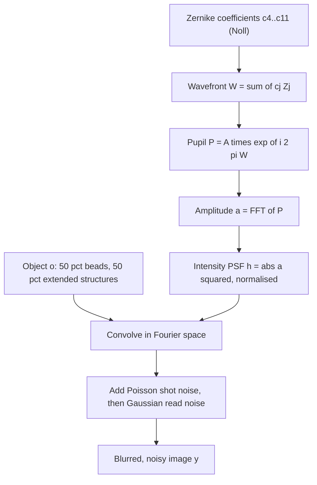
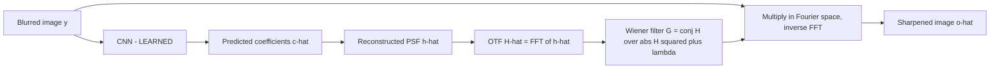
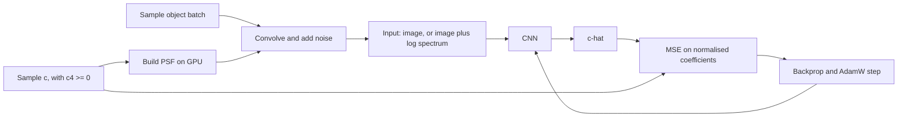

# Plan — ML Microscopy Deconvolution Demo

Phase 2 output. Turns `RESEARCH.md` into a concrete notebook structure, code
layout and execution budget.

---

## 0. Decisions made in this phase

| # | Decision | Rationale |
|---|---|---|
| **P1** | **Thin notebook + `deconv/` module** | The notebook carries the narrative, the parameters and the figures; the module carries the machinery. This is also what makes P5–P7 possible at all — notebook cells cannot be linted, type-checked or unit-tested. |
| **P2** | **Commit text and code only.** Weights, caches and datasets go in `.gitignore` | No binary artifacts in git. See the note below on notebook outputs. |
| **P3** | **`pooch` is a pinned dependency; images come from skimage's own cache** | Verified: `human_mitosis`/`cells3d`/`kidney` are *not* bundled and fetch from gitlab.com on first call. No download script and no committed images needed — skimage already solves this. One-time network requirement, documented in the notebook. |
| **P4** | **Device-agnostic with a CPU warning** | Target is the 5070 Ti, but the notebook should not crash for a reader on CPU — it should say the runs will be slow and offer a reduced step count. |
| **P5** | **Ruff** — lint clean at every step | |
| **P6** | **Pyright** in `standard` mode — type-checks clean at every step | `strict` fights numpy/torch stubs constantly and would cost more than it catches on a PoC. `standard` catches the real errors. |
| **P7** | **pytest** — every module function tested, run on every commit | The point is that a physicist reading the notebook never has to debug the machinery. |

### Note on notebook outputs (flagging a possible conflict)

"Commit text and code only" could be read as stripping notebook outputs too. I am
**keeping the executed outputs**, because an earlier locked requirement says the
demo must be showable *without* a 4 h live re-run — which is only possible if the
outputs are committed. The cost is that `deconvolution_demo.ipynb` carries
embedded figure PNGs and will be a few MB.

If you would rather strip outputs and accept that the notebook must be re-run to
be seen, say so and I will add `nbstripout` instead. **Weights, caches and
datasets are excluded either way.**

### Keeping the notebook didactic despite the module

Moving code into `deconv/` risks a notebook that reads as
`deconv.psf_from_pupil(...)` with the physics invisible. The rule to hold:

- **Every key equation appears in the notebook as LaTeX markdown**, next to the
  call that evaluates it. The module is the executable mirror of the formula, not
  a replacement for showing it.
- Plotting boilerplate goes in `deconv/viz.py` and is *not* shown — matplotlib
  setup is not physics and only distracts.

---

## 1. The physics, as a graph

How a synthetic micrograph is produced. Everything here is closed-form — no
learning anywhere in this diagram.



The label for supervised training is **`c` itself** — the vector that entered at
the top. This is why the problem is well-posed: we know the answer by construction.

## 2. The inference pipeline

Only the first box is learned. Everything downstream is algebra.



This split is the central teaching point: the network estimates a **physical
quantity**, and a **known inverse** does the restoration. Nothing is a black box
except the 8 numbers.

## 3. The training loop



Data is generated fresh on the GPU every step, so there is no dataset, no
DataLoader and no epoch — only steps. This is what keeps the i9-9900K out of the
critical path.

---

## 4. Notebook layout

Ordered by the **physics narrative**, not the usual ML one. A reader should be
able to stop after any part and have learned something complete.

### Part 0 — Setup
Imports, device selection (with CPU warning per P4), seeds, and the optical
constants table from `RESEARCH.md` §3 as executable code.

### Part 1 — How a microscope blurs
| § | Content | Figure |
|---|---|---|
| 1.1 | The pupil and the wavefront; the 8 Noll polynomials written out | Zernike mode gallery (8 panels) |
| 1.2 | **Orthonormality unit test** — assert `⟨Zi,Zj⟩ = δij` | Pass/fail output |
| 1.3 | Pupil → amplitude → intensity PSF | — |
| 1.4 | The Airy disc: all `c = 0` | PSF + radial profile, with the 226.6 nm first zero marked |
| 1.5 | Aberrated PSFs, one mode at a time | PSF gallery per mode |
| 1.6 | The OTF and its cutoff at `2·NA/λ` | OTF with cutoff ring marked |
| 1.7 | Forward model end to end | Object → blurred → noisy triptych |

### Part 2 — Why you cannot simply invert
| § | Content | Figure |
|---|---|---|
| 2.1 | Naive inverse filtering: divide by the OTF | The catastrophe — pure noise |
| 2.2 | Why: cutoff, interior zeros, `N/H` amplification | OTF slice with zeros marked, log scale |
| 2.3 | The Wiener filter, and what `λ_reg` buys | — |
| 2.4 | `λ_reg` sweep over a decade | Bias/variance strip: noisy → good → blurry |
| 2.5 | Richardson–Lucy, the microscopist's tool | RL vs Wiener side by side |
| 2.6 | **The punchline**: every method above needs `h`. We don't have it. | — |

### Part 3 — Learning the PSF
| § | Content | Figure |
|---|---|---|
| 3.1 | The GPU data generator | Sample batch: beads and extended structures |
| 3.2 | The label: 8 coefficients, `Z4 ≥ 0`, normalisation | Coefficient distribution histogram |
| 3.3 | The CNN | Layer summary + parameter count |
| 3.4 | **Overfit-one-batch smoke test** — GATE | Loss → ~0 on 8 samples |
| 3.5 | Run 1: image-only | Loss curve |
| 3.6 | Run 2: image + log spectrum | Loss curve |
| 3.7 | Comparison, and per-coefficient error | Grouped bar chart per Noll mode |

Expected in 3.7: `Z4` (defocus) is the weakest mode even with the sign
restriction, and the spectrum channel should help most on the high-order modes
whose OTF signature is a distinctive ring pattern.

### Part 4 — Closing the loop
| § | Content | Figure |
|---|---|---|
| 4.1 | Predicted `ĉ` → PSF → Wiener → sharpened | True vs predicted PSF side by side |
| 4.2 | **The money plot**: three-way comparison | Blurred / naive-PSF / **predicted** / oracle / ground truth |
| 4.3 | Metrics: PSNR, SSIM, FRC | Table + FRC curves with the resolution crossing marked |

### Part 5 — Does it work on real data?
| § | Content | Figure |
|---|---|---|
| 5.1 | Held-out real images, and the honesty caveat (§6 below) | `human_mitosis` and `kidney` samples |
| 5.2 | Run 1/2 model applied to real data — **the sim-to-real gap** | Same three-way plot, on real images |
| 5.3 | Run 3: retrain the winning variant with 10 % real `cells3d` | Loss curve |
| 5.4 | Did the gap close? | Before/after metric table |

### Part 6 — Limitations and what a real system would add
2D only; spatially-invariant PSF; scalar diffraction; defocus-sign degeneracy;
phase diversity as the standard fix; 3D and spatially-varying PSFs as the real
problem; CARE-style direct restoration as the alternative approach not taken.

---

## 5. Code architecture

### Repository layout

```
deconv/
  __init__.py
  optics.py      Zernike basis, pupil, PSF, OTF, Wiener, naive inverse
  data.py        object generators, noise, real-image loading
  model.py       PSFNet, train loop
  metrics.py     PSNR, SSIM, FRC
  viz.py         plotting helpers (not shown in the notebook)
tests/
  test_optics.py
  test_data.py
  test_model.py
  test_metrics.py
deconvolution_demo.ipynb
pyproject.toml            ruff + pyright + pytest config
.pre-commit-config.yaml
requirements.txt
.gitignore
```

Five modules, grouped by concept rather than by notebook part — `optics.py` is
the one a physicist would actually want to read.

### `deconv/optics.py`

```
zernike_noll(j, rho, theta)       the 8 closed-form polynomials, Noll indexed
zernike_basis(n_grid, radius)     -> (8, N, N), precomputed once
pupil_from_coeffs(c, basis)       -> complex pupil
psf_from_pupil(P)                 -> normalised intensity PSF
otf_from_psf(h)
wiener_filter(otf, lam)
apply_wiener(y, otf, lam)
naive_inverse(y, otf)             deliberately unregularised
```

### `deconv/data.py`

```
sample_coeffs(batch)              uniform, with c4 >= 0
make_beads(batch, size)
make_extended(batch, size)        filaments, blobs, discs
convolve_fft(obj, psf)
add_noise(img, photons, read_sigma)
synth_batch(batch, real_frac)     the whole GPU pipeline
load_real_slices(which)           cells3d / mitosis / kidney
```

### `deconv/model.py`

```
class PSFNet(nn.Module)
train(model, steps, ...)          one function, reused for all 3 runs
```

`train()` being a single reused function is what keeps three runs from becoming
three copies of a training loop — and makes the Run 3 comparison genuinely
controlled.

### `deconv/metrics.py`

```
psnr(a, b) / ssim(a, b)           thin wrappers over skimage
frc(img_a, img_b)                 two independent noise draws
```

### `deconv/viz.py`

```
plot_zernike_gallery(...)
plot_psf_and_profile(...)
plot_otf(...)
plot_lambda_sweep(...)
plot_loss_curves(...)
plot_three_way(...)               the money plot
plot_frc(...)
```

Notebook cells call these as one-liners so the narrative is not buried in
matplotlib.

### Object generators

| Generator | Spec |
|---|---|
| `make_beads` | 30–150 sub-diffraction emitters per 128² field, sub-pixel placement, log-uniform intensity over ~1 decade, small constant background |
| `make_extended` | Random filaments (random walks, dilated), blobs and discs at varying density — crude mimics of cytoskeleton and nuclei |

### Noise

Randomized per sample: peak photons log-uniform in ~50–2000, Poisson, then
Gaussian read noise `σ ≈ 1–5` ADU.

---

## 6. Data handling (P3)

| Purpose | Source | Access |
|---|---|---|
| Training, synthetic | Generated on GPU | None |
| Training, real (Run 3 only) | `skimage.data.cells3d()` → 60 z × 2 ch = **120 slices**, 256² | pooch, cached |
| **Held out** | `skimage.data.human_mitosis()` 512², `skimage.data.kidney()` 16 z × 3 ch = 48 slices 512² | pooch, cached |
| Fully offline fallback | `skimage.data.cell()` 660×550, bundled | none |

Verified working: all three fetch from gitlab.com into
`~/.cache/scikit-image/<version>/` on first call. Nothing is committed to the repo.

**Preprocessing for real images:** convert to float, per-image normalise to
`[0,1]`, extract 128² (or 256²) crops. `cells3d` channel 0 is membranes,
channel 1 is nuclei — both usable, and they give usefully different texture
statistics.

**The caveat to print in the notebook, not bury:** these images are *already
blurred* by the microscope that acquired them. Treating them as sharp ground
truth means our synthetic PSF is an additional blur on top of an unknown
existing one. Standard practice, but stated explicitly.

---

## 7. Execution budget

| Stage | Estimate |
|---|---|
| Parts 0–2 (physics, classical baselines, λ sweep) | < 1 min |
| Overfit-one-batch smoke test | < 1 min |
| Run 1 — image-only, 128², ~30 k steps | ~12 min |
| Run 2 — image + spectrum | ~12 min |
| Run 3 — winner + 10 % real | ~12 min |
| Evaluation, metrics, figures | ~5 min |
| Final 256² figure run | ~15 min |
| **Total** | **~60 min** |

Against a 4 h budget this leaves roughly 3× headroom — room for a longer run or
a hyperparameter sweep if the first results disappoint.

---

## 8. Hyperparameters (from `RESEARCH.md` §5.3)

| Setting | Value |
|---|---|
| Optimizer | AdamW, `lr = 3e-4`, `weight_decay = 1e-4` |
| Schedule | Cosine annealing, 500-step linear warmup |
| Batch | 64 at 128² |
| Steps | 30 000 |
| Precision | bf16 autocast |
| Loss | MSE on range-normalised coefficients |
| Augmentation | **None** |
| Seed | Fixed, set for torch / numpy / python |

---

## 8b. Tooling and quality gates (P5–P7)

### Configuration

All three tools configured in a single `pyproject.toml`.

| Tool | Mode | Scope |
|---|---|---|
| **Ruff** | lint + format, default rules plus `I` (import sort) | `deconv/`, `tests/` |
| **Pyright** | `standard` | `deconv/`, `tests/` |
| **pytest** | — | `tests/` |

Pyright runs in `standard` rather than `strict` deliberately: `strict` spends most
of its time fighting incomplete numpy and torch stubs, which costs more than it
catches on a project this size. Every function still carries full annotations.

### Running on every commit

A `.pre-commit-config.yaml` runs all three as a git hook. The `pre-commit`
framework is used rather than a raw `.git/hooks/pre-commit` because hooks in
`.git/` are not committed and would not survive a clone.

```
ruff check    < 1 s
ruff format   < 1 s
pyright       ~ 5–10 s
pytest        ~ 10–20 s
```

Roughly 30 s per commit, which is inside the range where people do not start
reaching for `--no-verify`. If it creeps past that, pyright and pytest move to a
pre-push hook and ruff stays on commit.

### Unit tests are CPU-only and fast

**Tests never train a model and never touch a GPU.** Convergence is verified by
the overfit-one-batch gate in the notebook, not by the test suite. Tests cover
correctness of the machinery; the notebook covers whether the science works.

### Test plan

The physics tests are the valuable ones — this is where a silent error would
otherwise propagate into a plausible-looking but wrong result.

**`test_optics.py`**
- Zernike basis is orthonormal: `⟨Zi,Zj⟩ = δij` over `ρ ≤ 1`
- Each mode has its expected rotational symmetry (`Z4`, `Z11` invariant; `Z5/Z6` 2-fold; `Z9/Z10` 3-fold)
- `c = 0` reproduces the Airy disc; first zero matches `0.61·λ/NA` within one pixel
- PSF sums to 1 and its centre of mass is at the grid centre
- `OTF(0) = 1`; OTF support vanishes beyond `2·NA/λ`
- Wiener with `λ → 0` approaches the naive inverse
- Wiener of a delta-function PSF is ~identity

**`test_data.py`**
- Bead count lands in the requested range; intensities positive; sub-pixel placement works
- Extended structures are non-degenerate (not all-zero, not saturated)
- `convolve_fft` of a delta PSF is the identity
- Convolution preserves total intensity
- Poisson noise preserves the mean, increases the variance
- Real loaders return the documented shapes and normalise into `[0,1]`
- **Held-out images never appear in the training pool** — asserted directly

**`test_model.py`**
- Forward pass returns `(batch, 8)` for both input variants
- Parameter count is in the planned 2–4 M range
- Fixed seed gives deterministic output
- One optimizer step on a fixed tiny batch decreases the loss (CPU, seconds)

**`test_metrics.py`**
- PSNR of identical images is large; decreases monotonically with added noise
- SSIM of identical images is 1
- FRC of an image with itself is ~1 across frequencies; of uncorrelated noise, ~0

---

## 9. Build order for Phase 3

Strictly bottom-up, so each layer is verified before the next depends on it.
**Every step ends green on ruff + pyright + pytest before the next begins** —
that is what "lints and type-checks at each step" means in practice.

| # | Step | Tests written alongside |
|---|---|---|
| 0 | Scaffolding: `pyproject.toml`, ruff/pyright/pytest config, pre-commit hook, `.gitignore` | — |
| 1 | Zernike basis ← *if this is wrong, everything is wrong* | orthonormality, symmetry |
| 2 | Pupil → PSF → OTF | Airy first zero vs `0.61·λ/NA`, normalisation, OTF cutoff |
| 3 | Forward model: convolve + noise | delta-PSF identity, intensity conservation, noise statistics |
| 4 | Classical inverse: naive, Wiener, RL with a **known** PSF ← *sanity gate: if this doesn't visibly sharpen, stop* | Wiener→naive limit, delta-PSF identity |
| 5 | Object generators | count ranges, non-degeneracy |
| 6 | Real-image loading | shapes, normalisation, **held-out disjointness** |
| 7 | CNN + `train()` | shapes, determinism, one-step loss decrease |
| 8 | Metrics | identity and noise-monotonicity properties |
| 9 | **Overfit-one-batch** in the notebook ← *gate* | — |
| 10 | The three runs | — |
| 11 | Evaluation, figures, real-data transfer | — |

Steps 1, 4 and 9 are the three places where a silent bug would otherwise survive
all the way to a confusing final result.

---

## 10. Risks specific to the build

| Risk | Mitigation |
|---|---|
| Zernike convention error | Orthonormality test at step 1, plus visual mode gallery — a wrong mode is obvious to the eye |
| FFT normalisation / fftshift errors | Verify Airy first-zero radius numerically against `0.61·λ/NA` |
| PSF not centred → image shifts | Check centre of mass; keep tip/tilt excluded |
| Coefficient scaling swamps the loss | Normalise each mode by its sampling range before MSE |
| Spectrum channel dominated by DC | `log(1 + |FFT|²)`, then per-image standardise |
| bf16 instability in FFTs | Keep the physics/forward model in fp32; autocast only the CNN |
| Run 3 comparison confounded | Change *only* the data mix; identical seed, steps, architecture |
