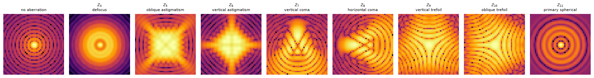
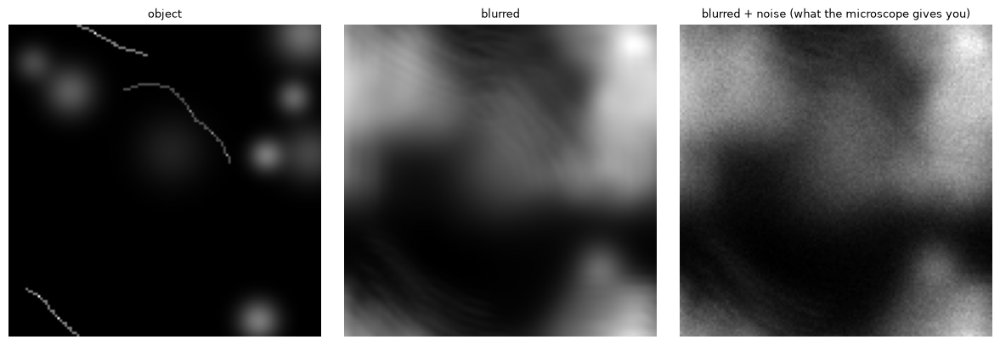
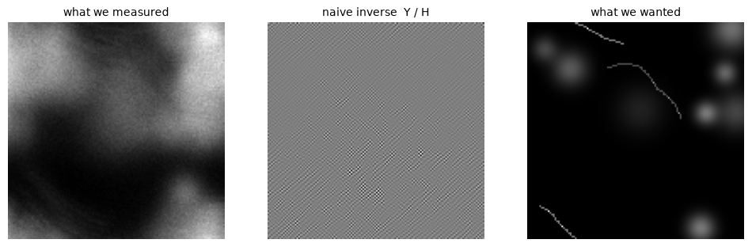
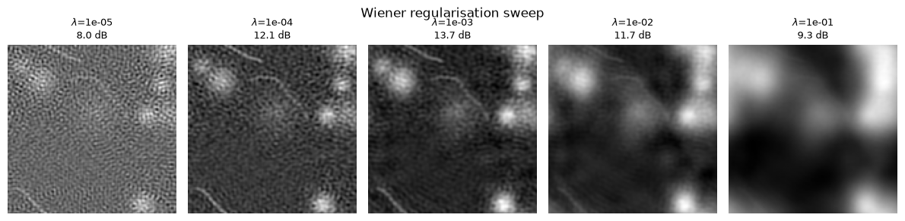
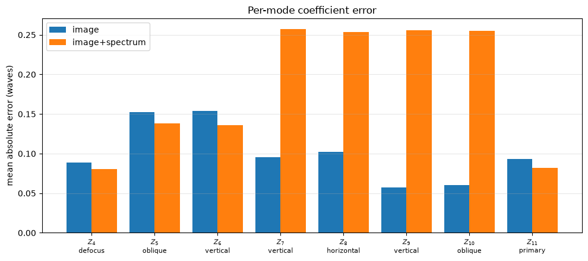
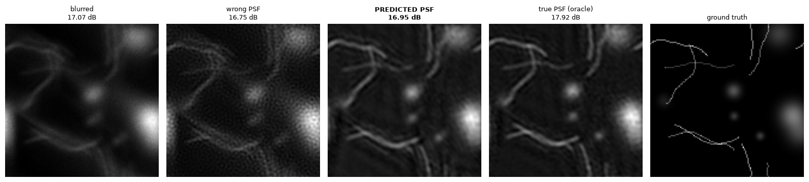
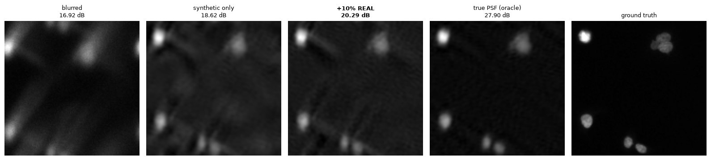

# Deacon of the Sharp

**Learning the point-spread function of a microscope from a single blurred image — then deconvolving with it.**

> [!WARNING]
> **This is a completely AI-coded demo, not a finished product.** The code, tests,
> notebook and documentation were written by AI agents. It is a proof of concept for
> learning and exploration — not a validated scientific tool. Do not use it for
> research results, clinical or diagnostic work, or any production purpose without
> independent review.

A microscope blurs. If you knew exactly *how* it blurred — its point-spread
function (PSF) — you could partly undo the damage. Usually you don't.

This repo trains a small convolutional network to look at a blurred fluorescence
micrograph and estimate the **optical aberration that produced it**, expressed as
eight Zernike coefficients. From those numbers the PSF is rebuilt in closed form,
and a classical Wiener filter sharpens the image.

```
blurred image ──► [CNN] ──► 8 Zernike coefficients ──► [closed-form PSF ─► Wiener inverse] ──► sharpened image
```

Only the eight numbers are learned. Everything else is physics — so when the model
is wrong, you can see *how* it is wrong.

<p align="center"></p>
<p align="center"><em>What each of the eight aberration modes does to a point of light. These shapes are the only evidence the network gets.</em></p>

---

## The story, in figures

Everything lives in [`deconvolution_demo.ipynb`](deconvolution_demo.ipynb), which
reads top to bottom as a lecture: physics first, then why the naive approach fails,
then the network.

### 1. How a microscope blurs

The forward model is object ⊛ PSF + noise. Shot noise (Poisson) and camera read
noise (Gaussian) are both simulated; the optics are a 1.4 NA oil objective imaging
GFP (520 nm) at 65 nm pixels — 1.43× inside Nyquist.



### 2. Why you can't just divide the blur out

In Fourier space the blur is a multiplication, `Y = H·O + N`, so `O = Y / H` looks
obvious. But the optical transfer function `H` is **exactly zero** above the cutoff
`2·NA/λ`, and dividing noise by zero gives garbage:



A regularised (Wiener) inverse fixes this, with a trade-off: too little
regularisation amplifies noise, too much leaves the blur.



**The catch:** all of that needs the *true* PSF. On a real microscope you don't
have it — aberration drifts with depth, temperature and specimen. That is the gap
the network fills.

### 3. Estimating the aberration

`PSFNet` is a small CNN (conv stack → global average pool → regression head onto 8
coefficients). Two input variants are compared: the image alone, and the image plus
its log power spectrum. Training data is generated on the fly on the GPU — bead
fields and synthetic filaments/blobs, each blurred by a random aberration.

Per-mode error, full run (predicting zero everywhere ≈ 0.25 waves):



The image-only model wins (MAE **0.10 waves** vs 0.18). The spectrum variant sits
at chance on coma and trefoil (Z₇–Z₁₀). Those odd modes only change the *sign* of
the PSF's asymmetry, which a power spectrum cannot see (`|H(f)| = |H(−f)|`). The
image is still in its input, so the likely story is that the network leaned on the
spectrum and never learned to read the sign from the image — a hypothesis, not yet
tested.

### 4. Does it actually sharpen the image?

Same measurement, four reconstructions: do nothing, assume a perfect Airy PSF,
use the **predicted** PSF, and use the true PSF (the oracle ceiling).



The predicted PSF lands within ~1 dB of the oracle, and visibly recovers the
filaments that the aberration-free assumption smears.

### 5. Does it survive real data?

Everything above is synthetic. Applied to **real fluorescence micrographs** it has
never seen (`skimage.data.human_mitosis`, strictly held out), the gap to the oracle
grows from 0.97 dB to 9.28 dB — an **8.3 dB sim-to-real penalty**. Retraining with
10 % real crops from a *different* dataset (`cells3d`) recovers **+1.67 dB**:



| model | PSNR on real data |
|---|---|
| blurred (do nothing) | 16.92 dB |
| trained on synthetic only | 18.62 dB |
| **+ 10 % real in training** | **20.29 dB** |
| oracle (true PSF) | 27.90 dB |

Real data helps, but most of the gap is still open. Stating that plainly is the point.

---

## Repository layout

```
deconv/
  optics.py    Optics config, Zernike basis (Noll), PSF/OTF, FFT convolution, Wiener & naive inverse
  data.py      Coefficient sampling, bead & extended-object synthesis, Poisson+read noise, real-data loaders
  model.py     PSFNet, training loop, prediction, per-mode error
  metrics.py   PSNR, SSIM, Fourier Ring Correlation (FRC) → resolution in nm
  viz.py       All notebook plots
tests/         90 tests — physics sanity checks (orthonormality, Airy radius, energy), data, model, metrics
deconvolution_demo.ipynb   The walkthrough; committed with full-run outputs
AGENDA.md · RESEARCH.md · PLAN.md   Design record: decisions, physics derivations, build plan
```

## Getting started

Python ≥ 3.11. Uses PyTorch and picks the best available device automatically:
**Apple Silicon GPU (MPS)** → CUDA → CPU.

```bash
uv venv -p 3.12 .venv
uv pip install -p .venv -r requirements.txt -e .
.venv/bin/pytest
.venv/bin/jupyter notebook deconvolution_demo.ipynb
```

(Plain `python -m venv .venv && pip install -r requirements.txt -e .` works too.)

The first cell has a `QUICK` switch:

| | `QUICK = True` | `QUICK = False` |
|---|---|---|
| image size | 64 px | 128 px |
| training steps | 600 | 30 000 |
| runtime | ~1 min | ~1 h on an RTX 5070 Ti; longer on Apple Silicon |
| results | pipeline smoke test only | the numbers above |

`skimage` datasets (`cells3d`, `human_mitosis`, `kidney`) are downloaded via `pooch`
on first use.

## Honest limitations

- **2D only.** Real depth-dependent aberration lives in the 3D PSF.
- **Shift-invariant PSF.** Off-axis variation is ignored.
- **Defocus sign is unrecoverable** from a single intensity image (`W` and its
  parity inverse give identical PSFs); training restricts `Z₄ ≥ 0`. Phase diversity
  would fix it.
- **Scalar diffraction.** At NA 1.4 a vectorial model would be more accurate.
- **Real "ground truth" is already blurred** by the microscope that acquired it;
  the synthetic PSF is applied on top.
- **Regularisation λ is hand-picked** from a known noise level.
- **Not an end-to-end image-to-image network** (CARE-style). That usually gives
  prettier pictures — but no physical quantity to check, and no way to tell
  recovered detail from hallucinated detail. This trades some performance for an
  estimate you can inspect and falsify.
